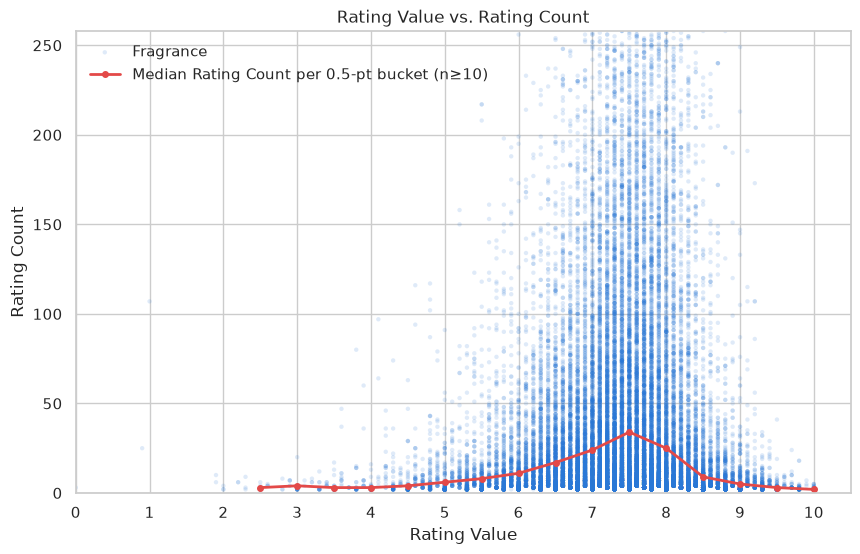
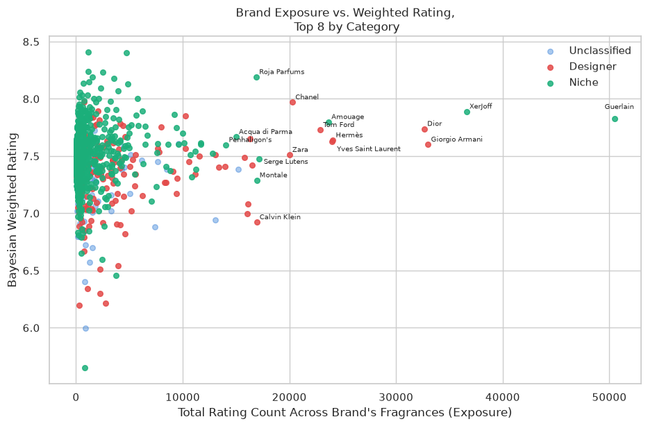

# Fragrance Analysis

An exploratory data analysis of 59,000 fragrances from the Parfumo database, uncovering trends in scent composition, niche vs. designer positioning, and what drives high ratings.

     

**[View the presentation deck](https://docs.google.com/presentation/d/1FZA2tMdAsJHUkRDgVOeMH3OOZcHjSdEQ/edit?usp=sharing&ouid=106881747495107562844&rtpof=true&sd=true)**: a 10-minute walkthrough of the whole project.

## Table of Contents

- [Project Overview](#project-overview)
- [Key Questions](#key-questions)
- [Project Structure](#project-structure)
- [Requirements &amp; Installation](#requirements--installation)
- [Usage](#usage)
- [Data](#data)
- [Exploratory Data Analysis](#exploratory-data-analysis)
- [Key Findings](#key-findings)
- [Technologies &amp; Libraries Used](#technologies--libraries-used)
- [Limitations &amp; Next Steps](#limitations--next-steps)
- [License](#license)
- [Author](#author)

## Project Overview

This is a capstone project for the StackFuel data analytics course, using a dataset of ~59,000 fragrances scraped from Parfumo.com to explore how user ratings behave: whether they follow a normal distribution, how they relate to popularity, and whether niche/independent perfumers really rate higher than designer/fashion houses.

The analysis is spread across three notebooks: [`01_cleaning.ipynb`](notebooks/01_cleaning.ipynb) (data cleaning and feature engineering), [`02_EDA.ipynb`](notebooks/02_EDA.ipynb) (exploratory analysis and statistical testing), and [`03_limitations.ipynb`](notebooks/03_limitations.ipynb) (a running log of known data-quality limitations).

## Key Questions

- Are fragrance ratings normally distributed, or do they skew toward a particular range?
- Does a fragrance's popularity (`Rating_Count`) predict its perceived quality (`Rating_Value`)?
- Is there a natural minimum-ratings cutoff below which average ratings shouldn't be trusted?
- Do niche/independent perfumers rate higher than designer/fashion houses on average, and if so, is that gap real or an artifact of exposure/brand popularity?

## Project Structure

```
fragrance-analysis/
├── data/
│   └── 02_Parfumo_Perfumes.csv.gz # raw scraped dataset (gzip-compressed)
├── notebooks/
│   ├── 01_cleaning.ipynb          # data cleaning & feature engineering
│   ├── 02_EDA.ipynb               # exploratory analysis & statistical testing
│   └── 03_limitations.ipynb       # known data-quality limitations log
├── src/fragrance_analysis/        # logic extracted out of the notebooks
│   ├── concentration.py           # Concentration -> Concentration_Group classifier
│   ├── brands.py                  # Brand -> Brand_Category classifier
│   └── ratings.py                 # Bayesian shrinkage weighted-rating estimator, Cohen's d
├── tests/                         # pytest tests for src/fragrance_analysis
├── images/                        # chart exports used in this README
├── pyproject.toml                 # project dependencies (uv)
├── uv.lock
├── LICENSE
└── README.md
```

## Requirements & Installation

Requires Python 3.13+. Dependencies and environment are managed with [uv](https://docs.astral.sh/uv/).

```bash
git clone https://github.com/JennyIseev/fragrance-analysis.git
cd fragrance-analysis
uv sync
```

This creates a `.venv` and installs all dependencies pinned in `uv.lock` (pandas, matplotlib, seaborn, statsmodels, pyarrow, ipykernel, pytest), plus an editable install of `src/fragrance_analysis` so the notebooks can import it directly.

Run the test suite with:

```bash
uv run pytest
```

## Usage

Start Jupyter (`uv run jupyter lab`) and run the notebooks in order, since each one builds on the previous:

1. [`01_cleaning.ipynb`](notebooks/01_cleaning.ipynb) – cleans the raw data and writes `data/cleaned_data.parquet`
2. [`02_EDA.ipynb`](notebooks/02_EDA.ipynb) – loads the cleaned data and runs the analysis
3. [`03_limitations.ipynb`](notebooks/03_limitations.ipynb) – also loads `data/cleaned_data.parquet` (requires step 1); logs limitations found in either step above

## Data

The dataset was originally compiled by Olga G. Miufana via web scraping of Parfumo.com (CC0 license) and was later republished on Kaggle as "Parfumo Perfume Database 59K Fragrances" by ibrahimqasimi.

⚠️ The Kaggle link is now no longer reachable (404).
To ensure reproducibility, the file is also included directly in this repository under `data/02_Parfumo_Perfumes.csv.gz` (`pandas.read_csv` reads gzip natively).

The dataset contains 59,325 entries for different fragrances from 1451 brands.
The column structure is as following:

| Column                    | Description                                  |
| ------------------------- | -------------------------------------------- |
| Number                    | Internal Parfumo ID                          |
| Name                      | Perfume name                                 |
| Brand                     | Fragrance house                              |
| Release_Year              | Year first released                          |
| Concentration             | EdT, EdP, Parfum, Cologne, After Shave, etc. |
| Rating_Value              | Average user rating                          |
| Rating_Count              | Number of user ratings                       |
| Main_Accords              | Dominant scent families                      |
| Top / Middle / Base_Notes | Notes smelled over time                      |
| Perfumers                 | Creator name(s)                              |
| URL                       | Link to the full entry                       |

## Exploratory Data Analysis

`01_cleaning.ipynb` takes the raw 59,325-row scrape and works through it in stages: checking missingness per column, dropping rows with no usable identifiers (missing name/brand, placeholder names, 9 fully duplicated rows, 35 rows sharing corrupted duplicate URLs), fixing systematic mislabeling where a fragrance's release year had been scraped into its name field, and converting `Release_Year`/`Rating_Count` to proper integer types. It also standardizes the comma-separated `Main_Accords`/`Notes`/`Perfumers` fields (stripping whitespace) and engineers two new features: a `Concentration_Group` (collapsing 412 raw concentration strings into 10 categories via the keyword classifier in [`src/fragrance_analysis/concentration.py`](src/fragrance_analysis/concentration.py)) and a `Brand_Category` (Designer / Niche / Unclassified, based on a manually curated list of ~300 brands). The cleaned result (59,239 rows) is exported to `data/cleaned_data.parquet`.

`02_EDA.ipynb` uses that cleaned data to answer the key questions above: the shape of the rating distribution, the relationship between rating count and rating value, and whether niche brands really outrate designer ones. A brand-level Bayesian shrinkage estimator (the same principle as IMDB's weighted rating, implemented in [`src/fragrance_analysis/ratings.py`](src/fragrance_analysis/ratings.py)) is built to rank brands fairly despite wildly different rating volumes, then tested with ANOVA, Welch's ANOVA, Tukey's HSD, and Cohen's d to confirm the niche-vs-designer gap holds up under scrutiny. Both extracted modules are covered by tests in [`tests/`](tests/).

Data-quality issues that surfaced along the way (a per-brand scraping cap at 20 fragrances, stale ratings on discontinued fragrances skewing brand rankings) are logged separately in `03_limitations.ipynb` rather than cluttering the analysis notebooks.

## Key Findings

- **Fragrance Ratings skew high, not normal.** Values cluster around a median of 7.4 with a left-skewed distribution (skewness ≈ -0.82): roughly 65% of all ratings fall in the 7.0-8.0 range, and scores below 5.0 are rare.
- **Popularity and quality diverge.** How many ratings a fragrance has barely predicts its rating value (Pearson r ≈ 0.085, r² < 1%). A linear fit across the full range would slope upward, but it's misleading at a glance: the relationship is actually hump-shaped, not linear. Fragrances with few ratings can land at either extreme, while heavily-rated fragrances regress toward the population mean (~7.5) instead of the top. A widely-rated fragrance is a *safe* bet, not necessarily a *great* one.

  
- **Niche brands genuinely outrate designer brands.** Niche houses score higher than designer houses by a real, small effect (Cohen's d ≈ 0.29, p ≈ 2×10⁻⁵), and the gap survives even when the ranking formula's smoothing is stripped away entirely. Designer brands carry ~3.6x more exposure (ratings) than niche brands, which would help designer scores if popularity were the driver, but exposure explains only ~2% of the variance in a brand's rating. Designer and "Unclassified" brands (cosmetics conglomerates, celebrity licenses, retailers) rate about the same, suggesting the gap is tied to mass-market positioning rather than having a clothing line specifically. *Why* niche rates higher (formulation strategy, who's doing the rating, price psychology, survivorship) remains an open question the dataset can't answer.

  

## Technologies & Libraries Used

- Python 3.13
- pandas / numpy — data cleaning, feature engineering
- pyarrow — Parquet I/O
- matplotlib / seaborn — visualization
- scipy / statsmodels — hypothesis testing (t-test, ANOVA, Tukey's HSD, Welch's ANOVA), OLS regression
- Jupyter — notebooks
- pytest — tests for `src/fragrance_analysis`
- uv — dependency and environment management

## Limitations & Next Steps

- **Per-brand scraping cap.** About two-thirds of brands are capped at exactly 20 fragrances, an artifact of the scraper only pulling the first listing page for most brands. This means fragrance-count-per-brand is a lower bound for most brands in the dataset.
- **Stale ratings skew brand rankings.** Some brands' historical rating volume comes from fragrances that are now discontinued and no longer carry live ratings (e.g. Aubusson: 6 fragrances in this dataset vs. 68 currently listed live). The used data is at least two years old and new ratings have changed the `Rating_Value` and `Rating_Count` for most fragrances. Still, the data is a good snapshot and can be used to indicate trends.
- **No sales, pricing, or review-text data.** The dataset covers only aggregate ratings and metadata, not sales volume, price, or the review text itself, so several plausible explanations for the niche-vs-designer gap (price psychology, formulation strategy, who's doing the rating) can't be tested directly.
- **Next steps:** sentiment analysis on review text, a model to predict `Rating_Value` from notes/accords/brand category or an analysis of popular notes and accords would be promising next steps.

## License

This project is licensed under the MIT License, see [LICENSE](LICENSE) for details.

## Author

Jenny Iseev

- GitHub: [@JennyIseev](https://github.com/JennyIseev)
